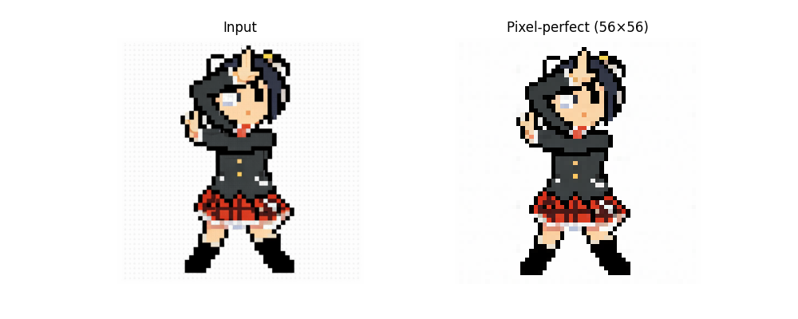

# Perfect Pixel

> **Automatically detect grid size and transforms imperfect AI-generated pixel art into perfectly aligned grids.**


<table>
  <tr>
    <th align="center">AI Generated</th>
    <th align="center">Refined</th>
  </tr>
  <tr>
    <td align="center">
      
    </td>
    <td align="center">
      
    </td>
  </tr>
  <tr>
    <td align="center">
      
    </td>
    <td align="center">
      
    </td>
  </tr>
</table>


Notice the inconsistent pixel sizes and blur in the original image.Every pixel is now perfectly 1x1, sharp and clear. 

## Features
- Automatically detect grid size for pixel arts.
- Refines pixel style image to perfectly aligned grids.

## Web Demo
[Try Web Demo](#web-demo)

## Installation
```bash
git clone https://github.com/theamusing/perfectPixel.git
```
or just download the python files and put them into your project folder.

## Usage
**Perfect Pixel** provides two implementations of the same core algorithm. The Lighweight Backend is designed in case you can't or don't want to use cv2. You can choose the one that best fits your environment:

| Feature | OpenCV Backend ([`perfectPixel.py`](./perfectPixel.py)) | Lightweight Backend ([`perfectPixelnoCV2.py`](./perfectPixelnoCV2.py)) |
| :--- | :--- | :--- |
| **Dependencies** | `opencv-python`, `numpy` | `numpy` |


#### For the OpenCV Backend
```python
import cv2
from perfectPixel import getPerfectPixel

bgr = cv2.imread("image1.png", cv2.IMREAD_COLOR)
rgb = cv2.cvtColor(bgr, cv2.COLOR_BGR2RGB)

w, h, out = get_perfect_pixel(rgb,)
```
*Also see [example.py](./example.py).*
```bash
python example.py
```

#### For the Lightweight Backend
```python
from perfectPixelnoCV2 import getPerfectPixel
from PIL import Image # for example we use PIL to load the image

img = Image.open("image.png").convert("RGB")
img_array = np.array(img)

w, h, out = get_perfect_pixel(imf_array)
```

## Use pip
Once published to PyPI, you will be able to install it via:
```
pip install perfect-pixel
```
```python
from perfect-pixel import getPerfectPixel 
```


